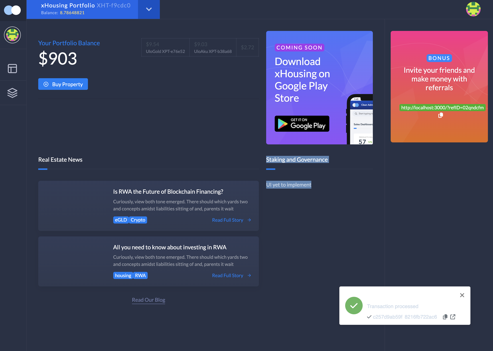
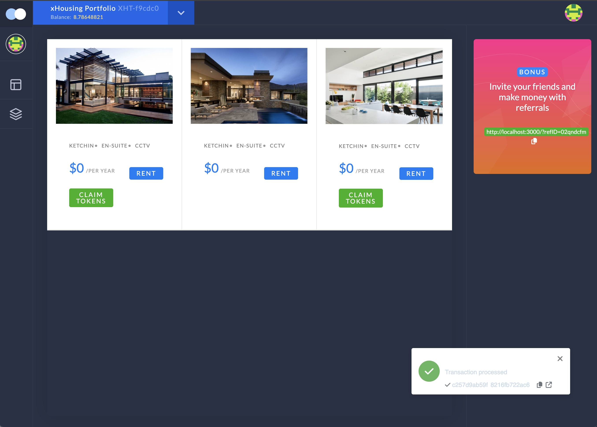

# xHousing

## Overview

In Abuja, Nigeria, the real estate market faces significant challenges that hinder both investors and developers. The high cost of entry, lack of access to liquid funds, and rising construction costs due to inflation create a market that is inaccessible to many potential investors and strained for developers. This situation results in insufficient housing availability, sub-standard construction quality, and expensive housing prices, both for purchase and rental. xHousing aims to address these multifaceted issues by leveraging blockchain technology to democratise real estate investment and provide developers with much-needed liquidity.


_Dashboard View_


_Properties View_

## Features

### Tokenization of Real Estate

**Fractional Ownership:** Real estate properties are tokenized, allowing multiple investors to own fractions of a property.
Semi-Fungible Tokens (SFTs): Each property has its own SFT collection representing fractional ownership.

### XHT Token

**Native Token:** Used for initial fundraising and rewarding participants.
Staking: Users can stake XHT and SFTs to earn rewards.

**Governance:** Stakers receive governance NFTs for voting rights and loyalty programs.

### Referral System

**Bonuses:** Referrers earn bonuses when users they referred claim staking rewards.

**Royalties:** Referrers earn a fraction of the royalties from secondary sales of SFTs.

### Rent Rewards

**Monthly Distribution:** Rent paid in various currencies is converted to XHT and distributed to SFT holders over a year.

**Burn Mechanism:** A fraction of the rent converted to XHT is burned, increasing the token's value.

## Impact and Relevance

### Democratization of Real Estate Investment

**Accessibility:** Allows individuals with limited capital to invest in real estate, traditionally a high-barrier market.

**Inclusivity:** Broadens the investor base and democratizes access to lucrative real estate investments.

### Support for Developers

**Liquidity:** Provides developers with immediate funds through token sales, ensuring timely and quality project completion.

**Affordable Housing:** Helps address the housing challenges in Abuja by enabling the development of high-quality, affordable housing projects.

### Economic Growth

**Boosting Investments:** By facilitating more investments in real estate, the platform contributes to economic stability and growth in the region.

**Job Creation:** Development projects lead to job creation and improved infrastructure in local communities.

# Detailed Description of the dApp's Design and Architecture

## Architecture

The backend of the xHousing dApp is powered by four smart contracts deployed on the MultiversX devnet. The frontend is a Next.js app, and it is deployed at [x-housing.vercel.app](https://x-housing.vercel.app)

### Smart Contracts

1.  **Coinbase Contract**: [Link to code](./contracts/coinbase)

    The [Coinbase](./contracts/coinbase) contract is responsible for managing the distribution and economics of XHT tokens
    within the xHousing platform. It interacts with the [XHTModule](./rust-packages/x-housing-module/) to perform token operations
    such as minting and burning. The contract ensures efficient token supply management by
    distributing XHT tokens to users participating in platform activities (e.g., fundraising,
    staking, referrals) and burning tokens to support deflationary mechanisms. Ownership and
    access control mechanisms are included to restrict certain operations to authorized parties,
    maintaining the integrity and security of the platform's token economy.

    Deployment: [erd1qqqqqqqqqqqqqpgqmepkngjhgw4kff4u976rmdpjpv3uc4mp0fuskv4y8j](https://devnet-explorer.multiversx.com/accounts/erd1qqqqqqqqqqqqqpgqmepkngjhgw4kff4u976rmdpjpv3uc4mp0fuskv4y8j)

2.  **xHousing Contract**: [Link to code](./contracts/x-housing)

    The [xHousing](./contracts/x-housing) contract is the main contract for the xHousing ecosystem. The management of ecosystem users will is done in this contract. User referrals, staking and governance is done here. Collection of staking rewards is also done here.

    Deployment: [erd1qqqqqqqqqqqqqpgqxaz0puawlrgazrq2d0qg58thd776fjaz0fusy7eqgv](https://devnet-explorer.multiversx.com/accounts/erd1qqqqqqqqqqqqqpgqxaz0puawlrgazrq2d0qg58thd776fjaz0fusy7eqgv)

3.  **xProject Template Contract**: [Link to code](./contracts/x-project)

    The [xProject](./contracts/x-project) contract template serves as the foundational blueprint for deploying
    individual real estate projects within the xHousing ecosystem.
    Each `xProject` contract represents a unique real estate development,
    managing its ownership, revenue distribution, and participant interactions.

    Deployment: [erd1qqqqqqqqqqqqqpgq2dwfaw667t5tp059jdfhwxqj34lwn8t80fusl3l40l](https://devnet-explorer.multiversx.com/accounts/erd1qqqqqqqqqqqqqpgq2dwfaw667t5tp059jdfhwxqj34lwn8t80fusl3l40l)

4.  **xProject Funding Contract**: [Link to code](./contracts/x-project-funding)

    The [xProjectFunding](./contracts/x-project-funding) contract is designed to manage the crowdfunding process for real estate projects within the xHousing ecosystem. This contract owns and deploys [xProject contracts](./contracts/x-project) which represents the properties on the platform. This contract facilitates the collection of funds from participants, handles participant registrations, deploys the `xProject` contract upon successful funding, and disburses tokens (XHT and SFT)
    to contributors. If the funding goal is not met by the deadline, it allows participants to withdraw their funds.

    Deployment: [erd1qqqqqqqqqqqqqpgq4qv8rgwxwmf9ujnlsxe2mgg9vgzdgjnu0fusn9thex](https://devnet-explorer.multiversx.com/accounts/erd1qqqqqqqqqqqqqpgq4qv8rgwxwmf9ujnlsxe2mgg9vgzdgjnu0fusn9thex)

# Media

-   [Pitch Deck](Pitch.key)
-   [Presentation](https://youtu.be/-h8h9u_LK2c)

# Project Set Up

-   Clone this Repo
-   Cd into the folder
-   Create a `config.toml` file in the `interact-rs` folder with the following content set

```toml
contracts_owner_pem = "path-to-pem-file.pem" # Used to deploy all contracts
gateway = "the-multiversx-public-gateway-you-chose-or-alocal-one" # eg "https://devnet-gateway.multiversx.com"
```

-   Now run `cargo run start-ico`. This will deploy all the contracts and create an `interaction` folder
-   Inside the interaction folder a `state.toml` file will be created, copy the contents and populate the appropriate `x-housing-ui/src/config/**` file
-   Now cd into the `x-housing-ui` folder and run `yarn install`
-   The run `yarn build-{CONFIG}` where `CONFIG` can be `devnet`, `localnet`, etc
-   Finally run `yarn preview` then visit the page at `http://localnet:3000`
